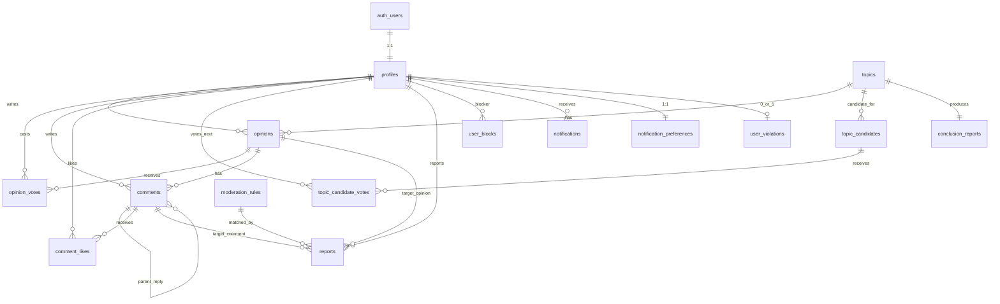

# 숙의야 — 데이터 모델 (ERD) v0

**대상:** v0 출시 범위 (PRD v1.1 §2.1 Tier 1 + §2.2 Tier 2 일부)
**작성:** 2026-05-25 (Phase 1 진입)
**기술 스택:** Supabase Postgres + Row Level Security
**버전:** ERD v0.2 (PM 5건 결정 반영)

---

## 0. 설계 원칙

1. **OAuth 1차 키 분리** — Supabase `auth.users`는 그대로 두고, 앱 도메인 정보는 `profiles`에 분리. 1:1 관계.
2. **1인 1계정 보강** — D2(provider+email 중복 차단)는 DB UNIQUE 제약으로 강제.
3. **시간 윈도우는 `topics`에 명시 저장** — 사이클이 매주 정해진 시각이지만, 운영자 비상 연장·당김 가능성을 위해 토픽별로 윈도우 컬럼 보관.
4. **삭제는 soft delete** — 작성 후 마감된 콘텐츠는 익명화하더라도 카운트·이력 보존 필요 (PRD §5.4).
5. **집계값은 별도 테이블·뷰** — `opinion_votes.vote='agree'` 카운트 같은 건 매번 집계하지 않고, `opinions.agree_count` 같은 캐시 컬럼 + 트리거로 유지.
6. **RLS 기본 거부** — 모든 테이블 RLS ON, 명시적 정책만 통과. 익명 사용자는 SELECT 일부만, INSERT/UPDATE/DELETE는 로그인 + 정책 통과 시만.
7. **JSONB는 최소화** — 미래 확장이 분명한 곳(`conclusion_reports.stats`, `notification_preferences.push_subscription`)만 사용.

---

## 1. 엔티티 한눈에 (v0 범위)

| # | 테이블 | 역할 | Tier |
|---|--------|------|------|
| 1 | `profiles` | 사용자 (auth.users 1:1 확장) | T1 |
| 2 | `topics` | 주제 (현재·과거·후보) | T1 |
| 3 | `topic_candidates` | 다음 주 주제 투표 후보 (F2) | T1 |
| 4 | `topic_candidate_votes` | 다음 주제 투표 (1인 1표) | T1 |
| 5 | `opinions` | 의견 (한 주제당 1인 1의견) | T1 |
| 6 | `opinion_votes` | 의견 투표 (동의·반대·잘 모름) | T1 |
| 7 | `comments` | 의견 댓글 (대댓글 1단계) | T1 |
| 8 | `comment_likes` | 댓글 좋아요 | T1 |
| 9 | `conclusion_reports` | 주간 결론 리포트 | T1 |
| 10 | `reports` | 신고 (의견·댓글) | T2 |
| 11 | `moderation_rules` | 룰 단어 사전 | T2 |
| 12 | `user_violations` | 위반 누적 (3회 1주 정지 등) | T2 |
| 13 | `user_blocks` | 사용자 차단 | T2 (F17) |
| 14 | `notifications` | 알림 | T2 |
| 15 | `notification_preferences` | 알림 on/off | T2 |

**v0 제외 (v0.5+):**
- 클러스터링 관련 (`user_clusters`, `cluster_assignments`)
- Steel-manning 기록 (F13)
- 점수형 토론 (F9 score)

---

## 2. ER 다이어그램



---

## 3. ENUM 타입 (Postgres `CREATE TYPE`)

```sql
-- 가입 경로
CREATE TYPE auth_provider AS ENUM ('kakao', 'naver');

-- 주제 상태
CREATE TYPE topic_status AS ENUM (
  'candidate',       -- 관리자가 후보로 등록만 한 상태
  'voting_next',     -- 일 22:00~23:59 다음 주제 투표 중
  'active',          -- 현재 주의 진행 주제 (월~일)
  'archived'         -- 마감된 주제 (read-only)
);

-- 주제 카테고리 (PRD §1.4 화이트리스트)
CREATE TYPE topic_category AS ENUM (
  'society',     -- 사회
  'tech',        -- 기술
  'lifestyle',   -- 생활
  'culture',     -- 문화
  'economy',     -- 경제
  'education',   -- 교육
  'environment'  -- 환경
);

-- 토론 형식 (F9, v0은 pro_con 고정)
CREATE TYPE topic_format AS ENUM ('pro_con', 'score');

-- 콘텐츠 상태 (의견·댓글 공통)
CREATE TYPE content_status AS ENUM (
  'published',
  'pending_review',  -- 룰 필터 실패 → 관리자 검토 대기
  'rejected',
  'deleted'          -- 작성자 또는 운영자 삭제 (soft delete)
);

-- 의견 투표 옵션
CREATE TYPE opinion_vote_value AS ENUM ('agree', 'disagree', 'unsure');

-- 신고 대상 종류
CREATE TYPE report_target_type AS ENUM ('opinion', 'comment');

-- 신고 처리 상태
CREATE TYPE report_status AS ENUM (
  'pending',
  'resolved_keep',     -- 검토 후 유지
  'resolved_remove'    -- 검토 후 삭제
);

-- 룰 종류
CREATE TYPE moderation_rule_type AS ENUM (
  'profanity', 'hate', 'personal_info', 'ad'
);

-- 알림 종류 (PRD F12)
CREATE TYPE notification_type AS ENUM (
  'comment_on_opinion',  -- 내 의견에 댓글
  'top_opinion',         -- 내 의견이 Top
  'top_comment',         -- 내 댓글이 Top
  'report_published',    -- 결론 리포트 발행
  'next_topic_voting'    -- 다음 주 주제 투표 시작
);
```

---

## 4. 엔티티 상세

### 4.1 `profiles`

사용자 도메인 정보. `auth.users.id`와 1:1.

| 컬럼 | 타입 | 제약/기본값 | 설명 |
|------|------|-------------|------|
| `id` | uuid | PK, FK `auth.users(id)` ON DELETE CASCADE | Supabase auth 사용자와 1:1 |
| `provider` | `auth_provider` | NOT NULL | kakao / naver |
| `provider_id` | text | NOT NULL | 카카오 sub 등 |
| `email` | citext | NOT NULL | 카카오에서 받은 이메일 (CITEXT로 대소문자 무시) |
| `email_hash` | text | NOT NULL | sha256(lower(email))의 hex. UNIQUE 인덱스용 |
| `nickname` | text | NOT NULL, UNIQUE | `숙의야_xxxx` 형태, 한글 포함 |
| `nickname_changed` | boolean | NOT NULL DEFAULT false | 1회 변경 후 true → 더 못 바꿈 |
| `nickname_changed_at` | timestamptz | nullable | 사이클 내 변경 차단 보조 (변경 시점) |
| `is_admin` | boolean | NOT NULL DEFAULT false | 운영자 권한 |
| `created_at` | timestamptz | NOT NULL DEFAULT now() | |
| `updated_at` | timestamptz | NOT NULL DEFAULT now() | 트리거로 자동 |

**제약:**
- `UNIQUE (provider, provider_id)` — 동일 provider의 같은 sub로 다중 가입 차단
- `UNIQUE (email_hash)` — D2 어뷰징 방지 핵심. 같은 이메일로 provider 바꿔 재가입 차단
- `UNIQUE (nickname)` — 닉네임 중복 차단
- `CHECK (char_length(nickname) BETWEEN 5 AND 20)` — `숙의야_xxxx` 최소 8자, 사용자 변경 시 한글 포함 여유

**인덱스:**
- PK `id`
- `(provider, provider_id)` UNIQUE
- `email_hash` UNIQUE
- `nickname` UNIQUE

**트리거:**
- BEFORE INSERT: `auth.users` row가 들어오면 `profiles` row 자동 생성 (닉네임 생성 알고리즘 호출 — `docs/nickname-rule.md` 참조)
- BEFORE UPDATE: `updated_at = now()`

**RLS:**
- SELECT: 모두 (익명 포함) — 닉네임 표시용. 단 `email`, `email_hash`, `provider_id`는 view로 마스킹.
- UPDATE: `auth.uid() = id` (자신만)
- INSERT/DELETE: 시스템 트리거만 (사용자 직접 불가)

---

### 4.2 `topics`

주제. 현재 진행/과거/후보 모두 한 테이블.

| 컬럼 | 타입 | 제약/기본값 | 설명 |
|------|------|-------------|------|
| `id` | uuid | PK DEFAULT gen_random_uuid() | |
| `title` | text | NOT NULL | 50자 이내 권장, CHECK 안 함 |
| `description` | text | NOT NULL | 주제 배경·설명 |
| `category` | `topic_category` | NOT NULL | PRD §1.4 화이트리스트 |
| `format` | `topic_format` | NOT NULL DEFAULT 'pro_con' | v0은 'pro_con' 고정 |
| `status` | `topic_status` | NOT NULL DEFAULT 'candidate' | |
| `cycle_starts_at` | timestamptz | NOT NULL | 월 00:00 KST |
| `cycle_ends_at` | timestamptz | NOT NULL | 일 22:00 KST |
| `opinion_window_starts_at` | timestamptz | NOT NULL | 화 00:00 |
| `opinion_window_ends_at` | timestamptz | NOT NULL | 수 23:59 |
| `vote_window_starts_at` | timestamptz | NOT NULL | 목 00:00 |
| `vote_window_ends_at` | timestamptz | NOT NULL | 토 23:59 |
| `comment_window_ends_at` | timestamptz | NOT NULL | 일 22:00 |
| `created_by` | uuid | NOT NULL, FK `profiles(id)` | 관리자 |
| `created_at` | timestamptz | NOT NULL DEFAULT now() | |

**제약:**
- `CHECK (cycle_starts_at < cycle_ends_at)`
- `CHECK (opinion_window_starts_at >= cycle_starts_at)`
- `CHECK (opinion_window_ends_at < vote_window_starts_at)`
- `CHECK (vote_window_ends_at <= comment_window_ends_at)`
- `CHECK (comment_window_ends_at <= cycle_ends_at)`
- **부분 UNIQUE:** "동시에 active 1개만" 강제
  ```sql
  CREATE UNIQUE INDEX one_active_topic_idx
    ON topics ((true)) WHERE status = 'active';
  ```

**인덱스:**
- PK `id`
- `(status, cycle_starts_at DESC)` — 아카이브·랭킹 조회용
- `category` — 카테고리별 필터

**RLS:**
- SELECT: 모두
- INSERT/UPDATE/DELETE: `is_admin = true`만

---

### 4.3 `topic_candidates`

다음 주 주제 투표 후보. 매주 한 번 일 22:00~23:59 동안 활성.

| 컬럼 | 타입 | 제약 | 설명 |
|------|------|------|------|
| `id` | uuid | PK | |
| `topic_id` | uuid | NOT NULL, FK `topics(id)` | 후보가 될 주제 (status=candidate) |
| `voting_round` | date | NOT NULL | 어느 주 일요일인지 (KST 일자) — 여러 라운드 구분 |
| `voting_starts_at` | timestamptz | NOT NULL | 일 22:00 |
| `voting_ends_at` | timestamptz | NOT NULL | 일 23:59 |
| `vote_count` | int | NOT NULL DEFAULT 0 | 캐시. 트리거 갱신 |
| `selected` | boolean | NOT NULL DEFAULT false | 다음 주 active로 채택됐는지 |
| `created_at` | timestamptz | NOT NULL DEFAULT now() | |

**제약:**
- `UNIQUE (topic_id, voting_round)` — 같은 주제 같은 라운드 중복 후보 차단
- `CHECK (voting_ends_at > voting_starts_at)`

**RLS:**
- SELECT: 모두
- INSERT/UPDATE/DELETE: `is_admin = true`만 (단 `vote_count` 갱신은 트리거로)

---

### 4.4 `topic_candidate_votes`

| 컬럼 | 타입 | 제약 | 설명 |
|------|------|------|------|
| `id` | bigserial | PK | |
| `candidate_id` | uuid | NOT NULL, FK `topic_candidates(id)` ON DELETE CASCADE | |
| `voter_id` | uuid | NOT NULL, FK `profiles(id)` | |
| `voting_round` | date | NOT NULL | 1인 1표 유니크 키 |
| `created_at` | timestamptz | NOT NULL DEFAULT now() | |

**제약:**
- `UNIQUE (voter_id, voting_round)` — 1라운드 1인 1표 (F2)
- 트리거: INSERT/DELETE 시 `topic_candidates.vote_count` 갱신

**RLS:**
- SELECT: 모두 (집계 결과 공개)
- INSERT: `auth.uid() = voter_id` AND 현재 시각이 `voting_window` 안 + 사용자가 로그인 상태
- UPDATE/DELETE: 본인만 (단, 마감 후 차단은 트리거에서)

---

### 4.5 `opinions`

| 컬럼 | 타입 | 제약 | 설명 |
|------|------|------|------|
| `id` | uuid | PK DEFAULT gen_random_uuid() | |
| `topic_id` | uuid | NOT NULL, FK `topics(id)` | |
| `author_id` | uuid | NOT NULL, FK `profiles(id)` | |
| `body` | text | NOT NULL | 100~300자 (PRD D9) |
| `status` | `content_status` | NOT NULL DEFAULT 'published' | |
| `rejection_reason` | text | nullable | pending_review/rejected 시 사유 |
| `agree_count` | int | NOT NULL DEFAULT 0 | 캐시 |
| `disagree_count` | int | NOT NULL DEFAULT 0 | 캐시 |
| `unsure_count` | int | NOT NULL DEFAULT 0 | 캐시 |
| `comment_count` | int | NOT NULL DEFAULT 0 | 캐시 |
| `created_at` | timestamptz | NOT NULL DEFAULT now() | |
| `updated_at` | timestamptz | NOT NULL DEFAULT now() | 트리거 |

**제약:**
- `UNIQUE (topic_id, author_id)` — 1인 1의견 (F3)
- `CHECK (char_length(body) BETWEEN 100 AND 300)` — D9
- `CHECK (status != 'rejected' OR rejection_reason IS NOT NULL)`

**인덱스:**
- `(topic_id, status, agree_count DESC)` — 주간 Top 의견 조회
- `(author_id, created_at DESC)` — 프로필 페이지

**RLS:**
- SELECT: `status = 'published'`은 모두. `status IN ('pending_review','rejected','deleted')`은 작성자 + 운영자만.
- INSERT: `auth.uid() = author_id` AND 현재가 `opinion_window` 안 AND 위반 정지 상태 아님
- UPDATE: 본인 + 작성 윈도우 내만 (정책에서 timestamp 비교)
- DELETE: 본인 (soft delete = status='deleted'로 UPDATE) 또는 운영자

---

### 4.6 `opinion_votes`

| 컬럼 | 타입 | 제약 | 설명 |
|------|------|------|------|
| `id` | bigserial | PK | |
| `opinion_id` | uuid | NOT NULL, FK `opinions(id)` ON DELETE CASCADE | |
| `voter_id` | uuid | NOT NULL, FK `profiles(id)` | |
| `vote` | `opinion_vote_value` | NOT NULL | agree/disagree/unsure |
| `created_at` | timestamptz | NOT NULL DEFAULT now() | |
| `updated_at` | timestamptz | NOT NULL DEFAULT now() | 투표 변경 가능 |

**제약:**
- `UNIQUE (opinion_id, voter_id)` — 1의견 1인 1표
- 트리거: INSERT/UPDATE/DELETE 시 `opinions.{agree,disagree,unsure}_count` 갱신
- 자기 의견 투표 차단:
  ```sql
  CREATE FUNCTION prevent_self_vote() RETURNS trigger AS $$
  BEGIN
    IF EXISTS (SELECT 1 FROM opinions
               WHERE id = NEW.opinion_id AND author_id = NEW.voter_id) THEN
      RAISE EXCEPTION '자기 의견에는 투표할 수 없습니다';
    END IF;
    RETURN NEW;
  END $$ LANGUAGE plpgsql;
  ```

**RLS:**
- SELECT: 모두 (단, **vote의 voter_id는 클라이언트 노출 금지** — 뷰로 집계만 노출)
- INSERT/UPDATE/DELETE: `auth.uid() = voter_id` AND vote_window 안

---

### 4.7 `comments`

| 컬럼 | 타입 | 제약 | 설명 |
|------|------|------|------|
| `id` | uuid | PK DEFAULT gen_random_uuid() | |
| `opinion_id` | uuid | NOT NULL, FK `opinions(id)` | |
| `parent_comment_id` | uuid | nullable, FK `comments(id)` | NULL=루트, 있으면 답글 (1단계만) |
| `author_id` | uuid | NOT NULL, FK `profiles(id)` | |
| `body` | text | NOT NULL | 200자 이내 |
| `status` | `content_status` | NOT NULL DEFAULT 'published' | |
| `like_count` | int | NOT NULL DEFAULT 0 | 캐시 |
| `created_at` | timestamptz | NOT NULL DEFAULT now() | |
| `updated_at` | timestamptz | NOT NULL DEFAULT now() | |

**제약:**
- `CHECK (char_length(body) BETWEEN 1 AND 200)`
- **대댓글 깊이 1 강제 (F5):**
  ```sql
  CREATE FUNCTION enforce_comment_depth() RETURNS trigger AS $$
  BEGIN
    IF NEW.parent_comment_id IS NOT NULL THEN
      IF EXISTS (SELECT 1 FROM comments
                 WHERE id = NEW.parent_comment_id
                 AND parent_comment_id IS NOT NULL) THEN
        RAISE EXCEPTION '답글의 답글은 허용되지 않습니다';
      END IF;
    END IF;
    RETURN NEW;
  END $$ LANGUAGE plpgsql;
  ```

**인덱스:**
- `(opinion_id, parent_comment_id NULLS FIRST, created_at)`
- `(author_id, created_at DESC)`

**RLS:**
- SELECT: `status='published'`은 모두. 차단당한 사용자(F17)의 댓글은 클라이언트 측 필터링 (RLS로 동적 차단도 가능하지만 v0은 단순화).
- INSERT: 로그인 + comment_window 안 + 위반 정지 아님
- UPDATE: 본인 + 작성 후 X분 이내(예: 5분) — 정책에서 시간 비교
- DELETE: 본인 (soft) 또는 운영자

---

### 4.8 `comment_likes`

| 컬럼 | 타입 | 제약 | 설명 |
|------|------|------|------|
| `id` | bigserial | PK | |
| `comment_id` | uuid | NOT NULL, FK `comments(id)` ON DELETE CASCADE | |
| `user_id` | uuid | NOT NULL, FK `profiles(id)` | |
| `created_at` | timestamptz | NOT NULL DEFAULT now() | |

**제약:**
- `UNIQUE (comment_id, user_id)` — 1댓글 1인 1좋아요
- 트리거: `comments.like_count` 갱신

**RLS:**
- SELECT: 모두
- INSERT: 로그인 + comment_window 안
- DELETE: 본인

---

### 4.9 `conclusion_reports`

주간 결론 리포트. F8 자동 발행.

| 컬럼 | 타입 | 제약 | 설명 |
|------|------|------|------|
| `id` | uuid | PK DEFAULT gen_random_uuid() | |
| `topic_id` | uuid | NOT NULL UNIQUE, FK `topics(id)` | 1주제 1리포트 |
| `published_at` | timestamptz | NOT NULL DEFAULT now() | 일 22:00 |
| `top_opinion_ids` | uuid[] | NOT NULL | 상위 5개 opinion id |
| `divisive_opinion_ids` | uuid[] | NOT NULL | 40~60% 분열 의견 3개 |
| `top_comment_ids` | uuid[] | NOT NULL | 상위 5개 comment id |
| `hall_of_fame_user_id` | uuid | nullable, FK `profiles(id)` | 그 주의 Top 의견 작성자 |
| `stats` | jsonb | NOT NULL DEFAULT '{}'::jsonb | `{participants, opinions, votes, comments}` |
| `share_card_url` | text | nullable | 공유 카드 이미지 |
| `created_at` | timestamptz | NOT NULL DEFAULT now() | |

**RLS:**
- SELECT: 모두
- INSERT/UPDATE: 시스템(Edge Function service role)만
- DELETE: 운영자만

---

### 4.10 `reports`

신고 (F10).

| 컬럼 | 타입 | 제약 | 설명 |
|------|------|------|------|
| `id` | bigserial | PK | |
| `reporter_id` | uuid | NOT NULL, FK `profiles(id)` | |
| `target_type` | `report_target_type` | NOT NULL | |
| `target_id` | uuid | NOT NULL | opinion 또는 comment id (FK 없음 — polymorphic) |
| `reason` | text | NOT NULL | |
| `status` | `report_status` | NOT NULL DEFAULT 'pending' | |
| `resolved_by` | uuid | nullable, FK `profiles(id)` | 운영자 |
| `resolved_at` | timestamptz | nullable | |
| `created_at` | timestamptz | NOT NULL DEFAULT now() | |

**제약:**
- `UNIQUE (reporter_id, target_type, target_id)` — 같은 사용자가 같은 대상 중복 신고 차단

**RLS:**
- SELECT: 본인 신고만, 운영자 전체
- INSERT: 로그인
- UPDATE: 운영자만

---

### 4.11 `moderation_rules`

| 컬럼 | 타입 | 제약 | 설명 |
|------|------|------|------|
| `id` | bigserial | PK | |
| `pattern` | text | NOT NULL | 정규식 또는 단어 |
| `rule_type` | `moderation_rule_type` | NOT NULL | |
| `active` | boolean | NOT NULL DEFAULT true | |
| `created_at` | timestamptz | NOT NULL DEFAULT now() | |

**RLS:** 운영자만 (SELECT/INSERT/UPDATE/DELETE 전부).

---

### 4.12 `user_violations`

| 컬럼 | 타입 | 제약 | 설명 |
|------|------|------|------|
| `user_id` | uuid | PK, FK `profiles(id)` ON DELETE CASCADE | 1인 1행 |
| `violation_count` | int | NOT NULL DEFAULT 0 | 누적 반려 횟수 |
| `last_violation_at` | timestamptz | nullable | |
| `suspended_until` | timestamptz | nullable | 1주 정지 종료 시각 |
| `banned` | boolean | NOT NULL DEFAULT false | 영구 정지 (5회) |

**RLS:**
- SELECT: 본인 + 운영자
- INSERT/UPDATE: 시스템(트리거) + 운영자

---

### 4.13 `user_blocks`

F17 차단. v0 포함.

| 컬럼 | 타입 | 제약 | 설명 |
|------|------|------|------|
| `id` | bigserial | PK | |
| `blocker_id` | uuid | NOT NULL, FK `profiles(id)` | |
| `blocked_id` | uuid | NOT NULL, FK `profiles(id)` | |
| `created_at` | timestamptz | NOT NULL DEFAULT now() | |

**제약:**
- `UNIQUE (blocker_id, blocked_id)`
- `CHECK (blocker_id != blocked_id)`

**RLS:**
- SELECT: 본인(`auth.uid() = blocker_id`)만
- INSERT/DELETE: 본인

---

### 4.14 `notifications`

| 컬럼 | 타입 | 제약 | 설명 |
|------|------|------|------|
| `id` | bigserial | PK | |
| `user_id` | uuid | NOT NULL, FK `profiles(id)` | 수신자 |
| `type` | `notification_type` | NOT NULL | |
| `target_type` | text | nullable | 'opinion', 'comment', 'topic', 'report' |
| `target_id` | uuid | nullable | |
| `payload` | jsonb | nullable | 추가 컨텍스트 |
| `read` | boolean | NOT NULL DEFAULT false | |
| `created_at` | timestamptz | NOT NULL DEFAULT now() | |

**인덱스:**
- `(user_id, read, created_at DESC)`

**RLS:**
- SELECT/UPDATE/DELETE: `auth.uid() = user_id`만
- INSERT: 시스템(service role)만

---

### 4.15 `notification_preferences`

| 컬럼 | 타입 | 제약 | 설명 |
|------|------|------|------|
| `user_id` | uuid | PK, FK `profiles(id)` ON DELETE CASCADE | |
| `comment_on_opinion` | boolean | NOT NULL DEFAULT true | |
| `top_opinion` | boolean | NOT NULL DEFAULT true | |
| `top_comment` | boolean | NOT NULL DEFAULT true | |
| `report_published` | boolean | NOT NULL DEFAULT true | |
| `next_topic_voting` | boolean | NOT NULL DEFAULT false | |
| `push_subscription` | jsonb | nullable | Web Push API endpoint·keys |
| `updated_at` | timestamptz | NOT NULL DEFAULT now() | |

**RLS:** 본인만 (`auth.uid() = user_id`).

---

## 5. RLS 정책 매트릭스 (요약)

| 테이블 | 익명 SELECT | 로그인 SELECT | 본인 INSERT | 본인 UPDATE | 본인 DELETE | 운영자 |
|--------|:----:|:----:|:----:|:----:|:----:|:----:|
| profiles | nickname만 view | 자기 전체 | × (트리거) | 자기 | × | 전체 |
| topics | published만 | 전체 | × | × | × | 전체 |
| topic_candidates | ○ | ○ | × | × | × | 전체 |
| topic_candidate_votes | 집계 view만 | 집계 view | 윈도우 내 | × | × | 전체 |
| opinions | published만 | + 본인 pending | 윈도우 내 | 윈도우 내 본인 | soft(본인) | 전체 |
| opinion_votes | 집계 view만 | 집계 view | 윈도우 내 | 본인 변경 | 본인 | 전체 |
| comments | published만 | + 본인 pending | 윈도우 내 | 본인+5분 | soft(본인) | 전체 |
| comment_likes | 집계 view만 | 집계 view | 윈도우 내 | × | 본인 | 전체 |
| conclusion_reports | ○ | ○ | service role | service role | × | DELETE |
| reports | × | 본인 신고만 | 로그인 | × | × | 전체 |
| moderation_rules | × | × | × | × | × | 전체 |
| user_violations | × | 본인만 | × | service role | × | 전체 |
| user_blocks | × | 본인 차단만 | 본인 | × | 본인 | × |
| notifications | × | 본인만 | service role | 본인 read | 본인 | × |
| notification_preferences | × | 본인만 | × (트리거) | 본인 | × | × |

---

## 6. 핵심 트리거 목록

| 트리거 | 위치 | 역할 |
|-------|------|------|
| `on_auth_user_created` | `auth.users` AFTER INSERT | `profiles` row 자동 생성 + 닉네임 부여 |
| `update_updated_at` | 모든 테이블 BEFORE UPDATE | `updated_at = now()` |
| `opinion_votes_count_sync` | `opinion_votes` AFTER I/U/D | `opinions.{agree,disagree,unsure}_count` 캐시 갱신 |
| `comment_likes_count_sync` | `comment_likes` AFTER I/D | `comments.like_count` 갱신 |
| `comment_count_sync` | `comments` AFTER I/D (status published) | `opinions.comment_count` 갱신 |
| `candidate_vote_count_sync` | `topic_candidate_votes` AFTER I/D | `topic_candidates.vote_count` 갱신 |
| `prevent_self_vote` | `opinion_votes` BEFORE INSERT | 자기 의견 투표 차단 |
| `enforce_comment_depth` | `comments` BEFORE INSERT | 답글 1단계 강제 |
| `enforce_violation_block` | `opinions`, `comments` BEFORE INSERT | 정지 상태 작성 차단 |
| `nickname_cycle_lock` | `profiles` BEFORE UPDATE | 같은 사이클 내 닉네임 변경 차단 (`nickname_changed_at` 기준) |

---

## 7. 마이그레이션 우선순위 (Phase 1 작업 순서)

ERD 검토 통과 후 다음 순서로 SQL 마이그레이션 작성·실행:

1. **001_enums.sql** — 모든 ENUM 타입
2. **002_profiles.sql** — `profiles` + `on_auth_user_created` 트리거 + 닉네임 함수
3. **003_topics.sql** — `topics` + `topic_candidates` + `topic_candidate_votes`
4. **004_opinions.sql** — `opinions` + `opinion_votes` + 트리거
5. **005_comments.sql** — `comments` + `comment_likes` + 트리거
6. **006_moderation.sql** — `moderation_rules` + `reports` + `user_violations`
7. **007_blocks_notifications.sql** — `user_blocks` + `notifications` + `notification_preferences`
8. **008_conclusion_reports.sql** — 결론 리포트 테이블 (Edge Function 작성과 같이)
9. **009_rls_policies.sql** — 모든 RLS 정책 일괄 적용
10. **010_views.sql** — 집계 뷰 (anonymous-friendly views for opinion_votes 등)

각 마이그레이션은 별도 commit. 로컬에서 `supabase db reset` 후 검증 → push.

---

## 8. v0.5+ 확장 메모

| 항목 | 추가 예상 테이블/컬럼 |
|------|------------------------|
| 클러스터링 (Polis) | `user_clusters`, `cluster_assignments`, `opinion_cluster_stats` |
| Steel-manning (F13) | `steelman_picks` (user_id, opinion_id, cycle) |
| 점수형 토론 (F9) | `opinion_votes.score` int 컬럼 추가 (1~5), vote enum 확장 |
| 이메일 알림 (v1) | `notification_preferences.email` boolean 추가 + 발송 큐 테이블 |
| 카카오톡 알림톡 (v1) | 외부 발송 이력 테이블 별도 |

---

## 9. PM 결정사항 (v0.2 반영)

2026-05-25 PM 합의:

| # | 항목 | 결정 | DB·정책 영향 |
|---|------|------|---------------|
| D-Q1 | 닉네임 변경 사이클 제약 | **마지막 변경 후 7일** | `nickname_cycle_lock` 트리거가 `nickname_changed_at + interval '7 days' > now()`이면 UPDATE 거부. 또한 `nickname_changed = true`이면 영구 변경 불가 |
| D-Q2 | 사용자 차단(F17) 범위 | **의견·댓글 노출만 막음 (집계엔 영향 없음)** | `user_blocks`는 클라이언트 측 필터 + 선택적 RLS 정책만 사용. 투표·좋아요 집계는 일반 카운팅 그대로 |
| D-Q3 | `opinion_votes` 가시성 | **집계 뷰로만 노출. voter_id는 본인+운영자만** | `opinion_vote_counts` 뷰 별도 생성 (anon에 SELECT 허용), 원본 테이블은 본인+운영자 SELECT |
| D-Q4 | 결론 리포트 발행 주체 | **Vercel Cron** | Supabase Edge Function 의존성 제거. Next.js Route Handler를 `vercel.json`의 `crons`로 호출. 코드 위치: `src/app/api/cron/publish-conclusion/route.ts` (Phase 2~3에서 구현). `conclusion_reports`는 Supabase service role key로 INSERT |
| D-Q5 | 시드 의견 처리 | **일반 `opinions`에 운영자 계정으로 작성. 별도 플래그 없음** | `opinions` 스키마 변경 없음. 운영자가 `is_admin=true` 계정으로 작성. UI상 일반 의견과 구분 표시 안 함 (시드도 1인 1의견 제약 따름) |

**Q4(Vercel Cron) 추가 메모:**
- `vercel.json`에 cron 등록 (예: `0 22 * * 0` KST 일 22:00 → UTC 13:00)
- Cron endpoint는 Bearer 토큰 검증 (Vercel `CRON_SECRET`)
- 발행 로직 실패 시 Sentry/로그 알림 (Phase 2~3에서 결정)
- Vercel Hobby 플랜은 cron 1일 1회 / 무료 플랜 한계 확인 필요 → 필요 시 Pro 업그레이드

---

## 10. 다음 단계

1. ~~PM 리뷰 → 미해결 항목 결정~~ ✓ 2026-05-25 완료 (§9)
2. `docs/nickname-rule.md` 작성 (닉네임 알고리즘 별도 명세) — 다음 작업
3. `supabase/migrations/001_enums.sql`부터 순차 작성
4. `supabase db reset`으로 로컬 검증 → 정책별 단위 테스트
5. 모든 마이그레이션 적용 후 Phase 0의 `signOut` 같은 기존 코드와 호환 확인
6. (Phase 2~3) Vercel Cron 엔드포인트 구현 (`src/app/api/cron/publish-conclusion/route.ts`)

— ERD v0.2 끝 —
